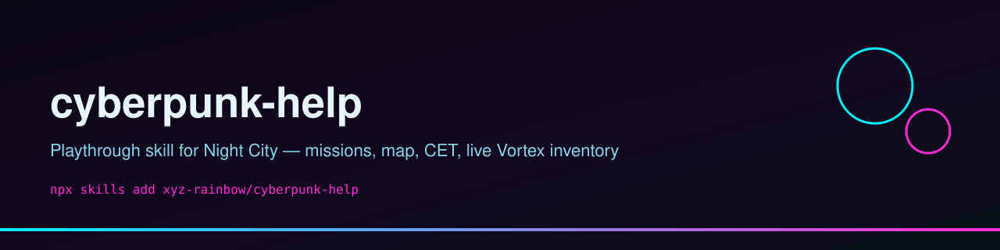
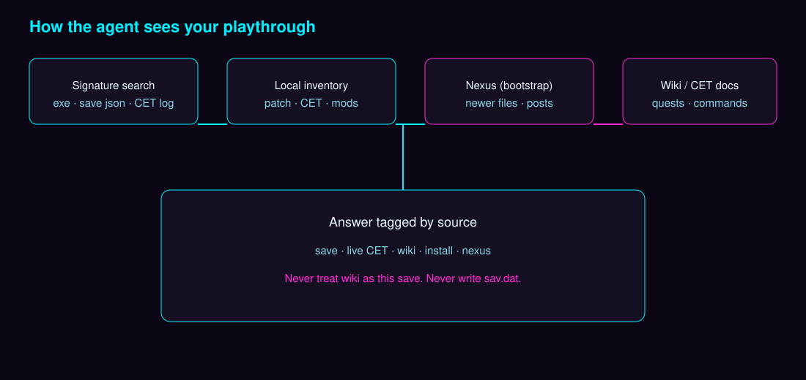
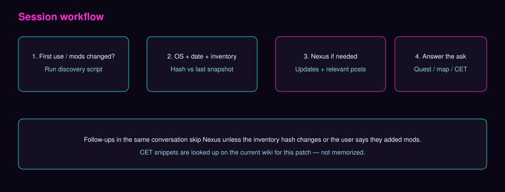

# cyberpunk-help

**Agent skill for a Cyberpunk 2077 playthrough** — missions, Night City locations, CET console lookup, and a live read of whatever is actually installed (Vortex or manual mods).

Works on **Windows, Linux, and macOS**. The skill does **not** ship a frozen mod list or save-folder table. On each machine it **discovers** the game and saves by signature files.

<p align="center">
  
  
  
  
  
  
</p>



## One-command installation

```bash
npx skills add xyz-rainbow/cyberpunk-help
```

Or via URL:

```bash
npx skills add https://github.com/xyz-rainbow/cyberpunk-help
```

Global, non-interactive:

```bash
npx skills add xyz-rainbow/cyberpunk-help -g -y
```

## What it does

- Reads **this** playthrough from save metadata (`metadata.9.json`) — quest path, position, patch — without editing `sav.dat`.
- Discovers **CET** version from the log next to the game, then looks up console commands on the **current** redmodding wiki (commands change per patch).
- On **first use in a session**, or when the Vortex deploy list changes, or when you say you added mods: inventory of installed mods + versions, OS, today’s date, then Nexus pages for newer files and relevant posts.
- Does **not** auto-deploy mods. Load-order fights and “should I install this?” belong in a separate `vortex-mods` skill.





## Prerequisites

- Python 3 (stdlib only) for `scripts/get_cp2077_help_context.py`
- Cyberpunk 2077 installed (Steam / GOG / Epic / Heroic / Proton)
- Optional: Vortex, Cyber Engine Tweaks

## Discovery script

Resolve the skill directory from wherever `SKILL.md` lives (for example after `npx skills add`, or under `~/.grok/skills/`). Then run:

```bash
python3 scripts/get_cp2077_help_context.py
```

Windows:

```powershell
powershell -NoProfile -ExecutionPolicy Bypass -File .\scripts\Get-Cp2077HelpContext.ps1
```

The script searches for `Cyberpunk2077.exe`, `vortex.deployment.json`, and save folders that contain both `metadata.9.json` and `sav.dat`. It does not assume a single canonical path.

## Limits

- Read-only on Vortex and saves
- No trainer / item dumps unless you explicitly ask
- CET mutate commands (teleport, facts) only on a clear request

**Performance tip:** First-run discovery seeds from Steam `libraryfolders.vdf`, your home directory, and mounted drives (`/mnt`, `/media`, etc. on Linux). On machines with large disks or many mounts, that scan can take a while. If it is slow or inconclusive, tell the agent your game root (the folder that contains `bin/x64/Cyberpunk2077.exe`) so it can skip a wide search.

## GitHub topics

`skills-sh` `npx-skills-add` `cyberpunk-2077` `vortex` `cyber-engine-tweaks` `ai-agent-skill` `linux` `windows` `steam-proton` `macos` `agent-skills`

## Sponsor this project

If this skill saves you time in Night City, consider supporting ongoing maintenance:

- [Buy Me a Coffee](https://buymeacoffee.com/xyzclouds)
- [Ko-fi](https://ko-fi.com/xyzclouds)
- [Patreon](https://patreon.com/xyzclouds)
- [PayPal](https://paypal.me/rainbowkolors)

## License

MIT. See [LICENSE](LICENSE).
